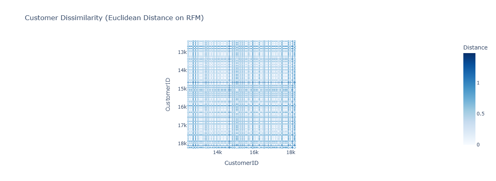
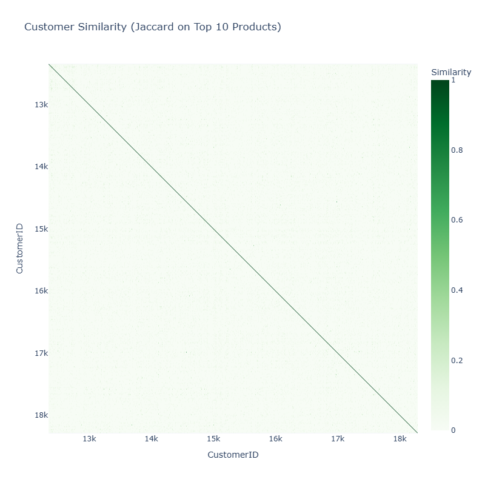
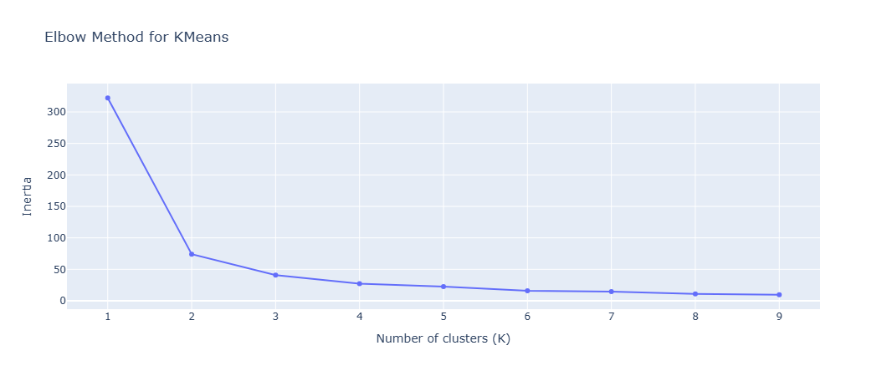
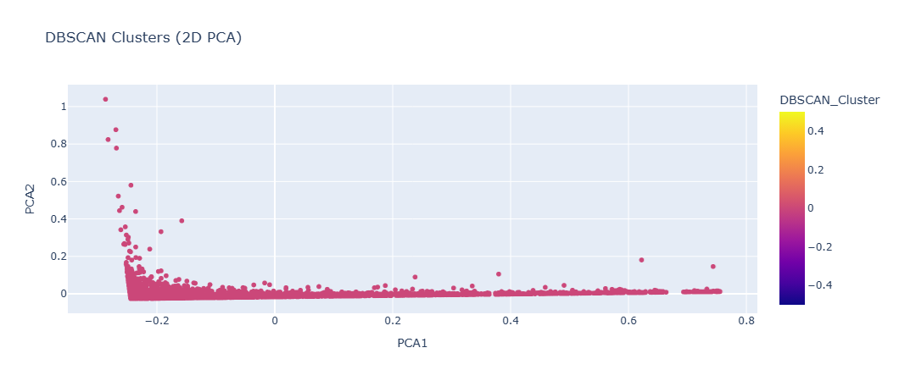
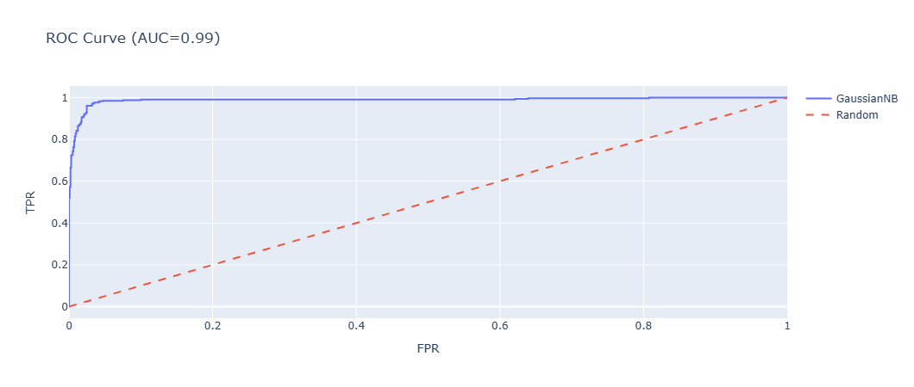
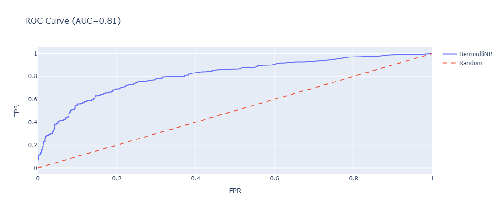
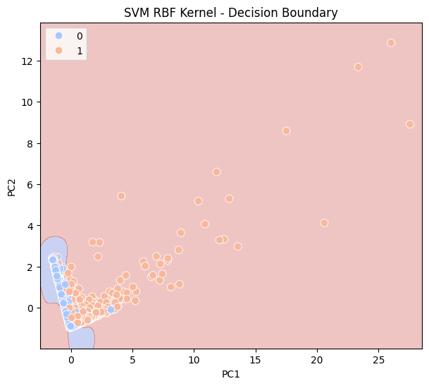

# Customer Analytics: Segmentation, Association Rules & Classification

## 📌 Project Overview

This project focuses on **understanding and predicting customer behaviour** based on retail transaction data.

The aim is to explore **which factors drive customer value**, segment customers into meaningful groups, discover product purchase patterns, and compare multiple machine learning models for classifying high-value customers.

---

## 📊 Dataset Description

* **Source File:** `Data.csv`
* **Total Raw Records:** 541,909 transactions
* **After Preprocessing:** 397,884 transactions | 4,338 unique customers
* **Date Range:** January 2011 – September 2011
* **Encoding:** ISO-8859-1

### **Transaction Details**

| Column | Type | Unique Values | Notes |
|---|---|---|---|
| `InvoiceNo` | Integer | 25,900 | Prefix `C` = cancellation (9,288 rows) |
| `StockCode` | String | 4,070 | Product code |
| `Description` | String | 4,223 | 1,454 missing values |
| `Quantity` | Integer | 722 | Ranges from –80,995 to 80,995 |
| `InvoiceDate` | String | 23,260 | Converted to datetime |
| `UnitPrice` | Float | 1,630 | GBP; ranges up to £38,970 |
| `CustomerID` | Integer | 4,372 | 135,080 missing values |
| `Country` | String | 38 | Dominated by United Kingdom (91.4%) |

### **Engineered Features**

* **TotalAmount** → `Quantity × UnitPrice` (transaction value, max £168,469)
* **Recency** → Days since last purchase (mean: 93 days, max: 374 days)
* **Frequency** → Unique invoices per customer (mean: 4.3, max: 209)
* **Monetary** → Total spend per customer (mean: £2,054, max: £280,206)
* **HighValue** → Binary target — customers above the 75th percentile of Monetary spend (≥ £1,662)

---

## ⚙️ Data Preprocessing

* **Missing Values**
  * 135,080 rows (~24.9%) had no `CustomerID` and were removed — they cannot be attributed to any customer for RFM analysis.
  * 1,454 rows with missing `Description` were retained as `StockCode` is sufficient for basket analysis.

* **Cancellation Removal**
  * 9,288 invoices starting with `C` were dropped to retain only completed purchases.

* **Invalid Transaction Removal**
  * Rows with `Quantity ≤ 0` or `UnitPrice ≤ 0` were removed to eliminate returns and data errors.

* **Feature Engineering**
  * `TotalAmount` derived from `Quantity × UnitPrice`.
  * `InvoiceDate` converted to datetime for time-based RFM calculations.
  * RFM table computed per customer (4,338 customers retained after cleaning).

* **Encoding & Scaling**
  * Transaction data encoded into a customer–product basket matrix for association mining.
  * RFM features scaled with `MinMaxScaler` for clustering and `StandardScaler` for SVM.

* **Target Variable Distribution**
  * High Value (1): **25%** of customers (Monetary > £1,662)
  * Low Value (0): **75%** of customers
  * Imbalanced but expected by design (top-quartile definition) → No oversampling applied.

---

## 🔍 Feature Analysis

### **Similarity & Dissimilarity Matrices**

* **Euclidean Distance** → Computed on min-max scaled RFM features to measure customer dissimilarity in purchase-value space.
  
* **Box-Cox Transformation**
* **Jaccard Similarity** → Computed on each customer's top-10 purchased `StockCode`s to measure behavioural product overlap.
  

### **Random Forest Feature Importance**

* **Top Predictors:** Monetary, Recency
* **Moderate Predictors:** Frequency, Luxury Assets, Annual Income
* **Low Predictors:** Country, self-employment status

### **Overall Insight**

* **Core Predictors:** Monetary spend and Recency are the strongest signals of customer value.
* **Supportive Predictors:** Frequency and product diversity add meaningful signal.
* **Weak Predictors:** Demographic or geographic features contribute minimally.

---

## 🤖 Model Implementation

### 1. **K-Means Clustering**

* **Optimal Clusters:** 2 (determined via Elbow Method on inertia over k = 1–9)
* **Highlights:** Clear separation between high-engagement and low-engagement customer segments; visualised via PCA (2 components).
  

### 2. **DBSCAN Clustering**

* **Parameters:** `eps=1.5`, `min_samples=3`
* **Highlights:** Identifies dense customer clusters and flags noise/outlier customers (label = –1) not belonging to any segment; complements K-Means results.
  

### 3. **Association Rule Mining — Apriori**

* **Basket:** Top 30 most purchased `StockCode`s (demo subset from 3,665 unique products)
* **Highlights:** Extracts frequent itemsets and generates rules filtered by minimum support, confidence, and lift.

### 4. **Association Rule Mining — FP-Growth**

* **Parameters:** `min_support=0.02`, `confidence ≥ 0.6`, `lift ≥ 1.2`
* **Applied on:** Full basket matrix across all 18,532 unique invoices
* **Highlights:** Faster than Apriori on larger baskets; produces high-confidence product recommendation rules with runtime comparison.

### 5. **Naïve Bayes Classification**

* **Target:** `HighValue` (top 25% by Monetary spend, threshold ≈ £1,662)
* **GaussianNB** → Trained on numeric RFM features (Recency, Frequency, Monetary).
  
* **BernoulliNB** → Trained on binarised top-20 product purchase flags per customer.
  
* **Evaluation:** Confusion matrix, ROC curve, AUC score for both variants.

### 6. **Support Vector Machine (SVM)**

* **Features:** StandardScaler → PCA (2 components) on RFM
* **Train/Test Split:** 70% / 30%, `random_state=42`
* **SVM Linear:** Best `C=1` via GridSearchCV (5-fold CV), Test Accuracy ≈ **90.86%**
* 
  

* **SVM RBF:** Best `C=10, gamma=1` via GridSearchCV (5-fold CV), Test Accuracy ≈ **90.94%**
* 
  

* **Highlights:** Decision boundary plots generated for both kernels on the 2D PCA space.
---

## 📈 Model Comparison

| Metric | GaussianNB | BernoulliNB | SVM Linear | SVM RBF |
|---|---|---|---|---|
| Task | Classification | Classification | Classification | Classification |
| Features | RFM (numeric) | Top-20 items (binary) | PCA of RFM | PCA of RFM |
| Test Accuracy | Reported via AUC | Reported via AUC | 0.9086 | **0.9094** |
| Kernel / Type | Gaussian | Bernoulli | Linear | RBF |
| Best Params | — | — | `C=1` | `C=10, gamma=1` |

---

## ✅ Conclusion

* **SVM RBF is the best classifier** → Highest accuracy (~90.94%) with well-tuned hyperparameters.
* **SVM Linear is nearly as strong** → Simpler model, competitive accuracy (~90.86%), more interpretable.
* **Naïve Bayes provides a fast baseline** → GaussianNB leverages RFM directly; BernoulliNB captures binary purchase patterns effectively.
* **K-Means produces clean segments** → Two distinct customer groups emerge, useful for targeted marketing campaigns.
* **DBSCAN complements K-Means** → Identifies outlier customers (e.g. one-time bulk buyers) that don't fit standard segments.
* **FP-Growth outperforms Apriori in speed** → Both yield actionable product association rules for recommendation engines.
* **Monetary spend and Recency are the most influential features** in determining high-value customer status.

---